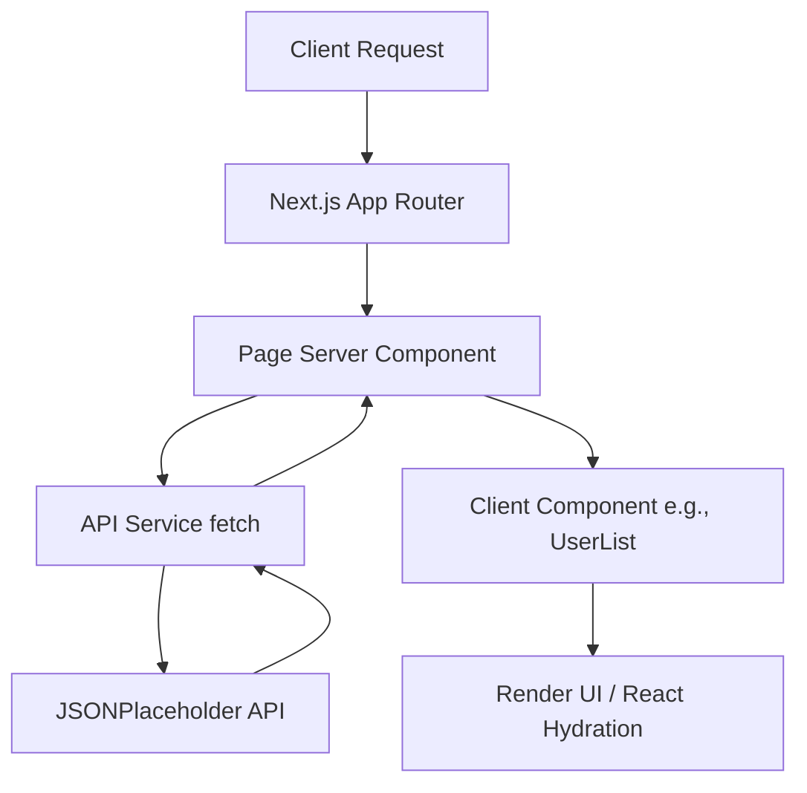

# Application Architecture

## Overall Architecture
The application uses the **Next.js App Router** paradigm, which enforces a strict separation between server-side data fetching and client-side interactivity.

### 1. Data Layer (Server)
- Found in `src/services/api.ts`
- Uses native `fetch` with caching strategies to pull data from JSONPlaceholder.
- Data is strongly typed using interfaces from `src/types/user.ts`.

### 2. Presentation Layer (Server Components)
- `src/app/page.tsx` and `src/app/users/[id]/page.tsx`
- These are Server Components. They fetch data asynchronously on the server before sending any HTML to the client. This results in zero layout shift and instantaneous initial loads.

### 3. Interactive Layer (Client Components)
- `src/features/users/components/UserList.tsx`
- Uses the `"use client"` directive. It receives the initially fetched data as props, and then manages local state (search term, sort order) via React Hooks.

### 4. UI Component Library
- `src/components/ui/`
- Contains shadcn/ui components. These are completely decoupled from business logic and strictly handle presentation and accessibility.

## Directory Flow

